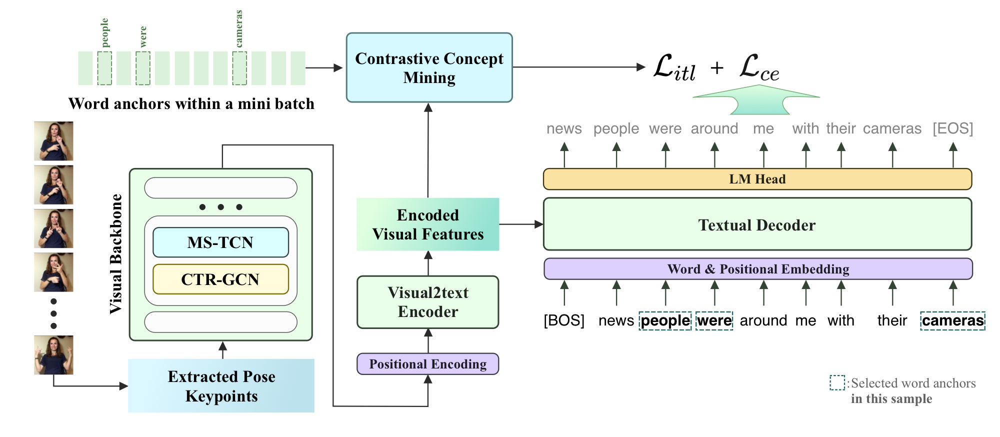

# 🖐️GloFE: Gloss-Free End-to-End Sign Language Translation
🌟Accepted at ACL 2023 main conference as Oral. [GloFE: Gloss-Free End-to-End Sign Language Translation](https://arxiv.org/abs/2305.12876)(arXiv).
<!-- <div align="center">

</div> -->


## Pre-trained Weights
### OpenASL
| Model Name | BLEU-4 | BLEURT | link |
|-|-|-|-|
| GloFE(VN) | 7.06 | 36.35 | [Google Drive](https://drive.google.com/file/d/18jwr8I7utzkBuRMOK5JLIyjvZIKQkWBi/view?usp=sharing) |
| GloFE(N)  | 6.82 | 36.68 | [Google Drive](https://drive.google.com/file/d/1_u0FT7SaREUGEYVaC9iZEICdbdE8dazs/view?usp=sharing) |
### How2Sign
| Model Name | BLEU-4 | BLEURT | link |
|-|-|-|-|
| GloFE(VN) | 2.24 | 31.65 | [Google Drive](https://drive.google.com/file/d/1ASf_UrKJ9hMd4_NIwj1Ov2WOOf4dK0lT/view?usp=sharing) |

## Data Prepreation
### File structure for OpenASL dataset
Since OpenASL does not provide pose data, we need to extract using MMPose and organize the extracted features in the following fashion:
```bash
/path/to/OpenASL
├── mmpose
│   ├── 00ADU7t7IWI-00:00:00.460-00:00:01.106.pkl
│   ├── xxxxxxxxxxxxxxxxxxxxxxxxxxxxxxxxxxxxx.pkl
│   ├── ...
└─  └── xxxxxxxxxxxxxxxxxxxxxxxxxxxxxxxxxxxxx.pkl
```

### File structure for How2Sign dataset
```bash
/path/to/How2Sign
├── openpose_output
│   ├── json
│   │   ├── 14BL0rO5e-8_3-8-rgb_front
│   │   │   ├── 14BL0rO5e-8_3-8-rgb_front_000000000000_keypoints.json
│   │   │   ├── 14BL0rO5e-8_3-8-rgb_front_000000000001_keypoints.json
│   │   │   ├── ...
└─  └─  └─  └── 14BL0rO5e-8_3-8-rgb_front_000000000252_keypoints.json
```
### Extracting pose data for OpenASL using MMPose
Set output path in `tools/extract_openasl_mp.py`:
```python
    # config output_root in tools/extract_openasl_mp.py
    arg_dict = {
        ...
        'output_root': '/path/to/OpenASL/mmpose',
        ...
    }
```
Generate `open_asl_samples.txt` and set it in `tools/extract_openasl_mp.py`. Each line in `open_asl_samples.txt` is the full path to the `mp4` file.
```python
    all_samples = load_sample_names('/path/to/open_asl_samples.txt')
```
Install MMPose and set the `MMPOSE_ROOT`(path to MMPose's git dir) in `tools/extract.sh`. After installation, download the model checkpoints listed in `tools/extract.sh` and put them in `/path/to/mmpose/models`. Then run `tools/extract.sh`
```bash
    sh tools/extract.sh 0 1 0
                        │ │ └─ # GPU device-id to run on
                        │ └─── # Number of sub-splits (for parallel extraction)
                        └───── # Split id for this process
```
If you encountered version mismatch, try the following ones (thanks to @sandeep-sm in [issue #4](https://github.com/HenryLittle/GloFE/issues/4)):
```bash
MMPose - v0.29.0
mmcv==1.6.2
mmdet==2.25.2
mmtrack>=0.6.0
xtcocotools==1.12
```

## Training and Inference

### Environment Setup

Clone the repository:
```bash
git clone git@github.com:HenryLittle/GloFE.git
```
Create conda environment:

```bash
conda create --name glofe python=3.8
conda activate glofe
conda install pytorch==1.10.1 torchvision==0.11.2 torchaudio==0.10.1 cudatoolkit=11.3 -c pytorch -c conda-forge
pip install -r requirements.txt
```
<!-- ```bash
conda create --name glofe python=3.8
conda activate glofe
conda install pytorch==1.12.0 torchvision==0.13.0 torchaudio==0.12.0 cudatoolkit=11.3 -c pytorch
pip install -r requirements.txt

``` -->

For inference or training, use the scripts provided in `scripts/{dataset_name}/`. All python commands or scripts should be excuted under the `GloFE` home folder.
### Inference
Specifies the following argument to match your local environment before running the script (use OpenASL as an example):
 - `--work_dir_prefix`: path to the **work_dir**
 - `--work_dir`: supports two level of folders, usually in the format of \<dataset\>/\<exp_name\>
 - `--weights` : path to the folder containing downloaded **weights** and **exp_config.json** files
 - `--prefix` (Optional): name prefix of the output files
 - `--tokenizer` (Optional): path to tokenizer folder, don't need to modify unless you want to use another one

```bash
# scripts/openasl/test.sh
python train_openasl_pose_DDP_inter_VN.py \
    --ngpus 1 \
    --work_dir_prefix "path/to/work_dir" \
    --work_dir "openasl/vn_model" \
    --tokenizer "notebooks/openasl-v1.0/openasl-bpe25000-tokenizer-uncased" \
    --bs 32 \
    --prefix test-vn \
    --phase test --weights "work_dir/openasl/vn_model/glofe_vn_openasl.pt"
```


### Train 
For training, we provide DDP script and single card script. Specifies the following argument to match your local environment before running the script (use OpenASL as an example):
 - `--work_dir_prefix`: path to the **work_dir**
 - `--work_dir`: supports two level of folders, usually in the format of \<dataset\>/\<exp_name\>
 - `--feat_path`: path to the extracted pose features
 - `--label_path`: path to the **openasl-v1.0.tsv** provided by OpenASL
 - `--tokenizer` (Optional): path to tokenizer folder, don't need to modify unless you want to use another one

```bash
# scripts/openasl/train_ddp.sh
GPUS=4
torchrun --nnodes=1 --nproc_per_node=$GPUS train_openasl_pose_DDP_inter_VN.py \
    --ngpus $GPUS \
    --work_dir_prefix "path/to/work_dir" \
    --work_dir "openasl/train_test" \
    --bs 48 --ls 0.2 --epochs 400 \
    --save_every 5 \
    --clip_length 512 --vocab_size 25000 \
    --feat_path "path/to/mmpose" \
    --label_path "path/to/openasl-v1.0.tsv" \
    --eos_token "</s>" \
    --tokenizer "notebooks/openasl-v1.0/openasl-bpe25000-tokenizer-uncased" \
    --pose_backbone "PartedPoseBackbone" \
    --pe_enc --mask_enc --lr 3e-4 --dropout_dec 0.1 --dropout_enc 0.1 \
    --inter_cl --inter_cl_margin 0.4 --inter_cl_alpha 1.0 \
    --inter_cl_vocab 5523 \
    --inter_cl_we_path "notebooks/openasl-v1.0/uncased_filtred_glove_VN_embed.pkl"
```

## Miscs
If you plan to run GloFE on other datasets, here are the instructions on how to:
- train the BPE tokenizer
- filter out the anchor words and generate the files needed for the model

\*Details are now WIP, refer to the notebooks in the `notebooks` folder for now.

## Citing GloFE
If you find this work useful, please consider giving it a star ⭐ and citing our paper in your work:
```
@inproceedings{lin-etal-2023-gloss,
    title = "Gloss-Free End-to-End Sign Language Translation",
    author = "Lin, Kezhou  and Wang, Xiaohan  and Zhu, Linchao  and Sun, Ke  and Zhang, Bang  and Yang, Yi",
    booktitle = "Proceedings of the 61st Annual Meeting of the Association for Computational Linguistics (Volume 1: Long Papers)",
    month = jul,
    year = "2023",
    address = "Toronto, Canada",
    publisher = "Association for Computational Linguistics",
    url = "https://aclanthology.org/2023.acl-long.722",
    doi = "10.18653/v1/2023.acl-long.722",
    pages = "12904--12916",
}

```
